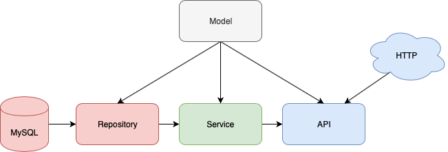
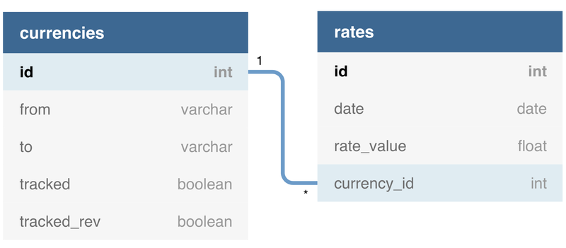

# Foreign Currency Excercise

## Setup with Docker
1. Change `config.example.json` to `config.json`
2. `config.example.json` has default configuration for deployment in docker, so no need to change
3. Run docker compose command
```
$ docker-compose up --build
```
4. By default, it will run on port 8000, `localhost:8000`

## Setup without Docker
1. Change `config.example.json` to `config.json`, and change the configuration
2. Make sure you have mysql running on your machine
3. Make sure this repo placed in proper $GOPATH
4. Run command
```
$ make build
$ make start
```
4. By default, it will run on port 8000, `localhost:8000`

## Testing (without Docker only)
1. Make sure you have mysql running on your machine
2. Run command
```
$ make build
$ make test
```

## General Architecture
This project has 4 Domain layer :

- Model Layer
- Repository Layer
- Service Layer
- API Layer

<div style="text-align:center"></div>

- Model layer : consist of all domain model within system
- Repository layer : layer to access database either RDBMS or NoSQL. But, in this implementation, I use MySQL
- Service layer : all business logic implement here
- API Layer : how client interact with system. In this implementation, I use HTTP

## Database Design

<div style="text-align:center"></div>

It uses 2 tables, currencies and rates. It has cardinality one to many, since one currency can has many daily rates.
Currencies has special attribute, `"tracked"` and `"tracked_rev"`. These attribute uses for marking currency to be tracked. Currency always store unique pair based on attribute `"from"` and `"to"`. It guarantee by the app that `"from"` is always less than `"to"` lexicographically. If we want to track in reverse order (`"from"` is greater than `"to"`), tracked_rev should be marked as true. This can reduce database storage, since we only store 1 tuple for the same symbols instead of 2.

Rates uses 4 attributes, `"id"` as primary key, `"date"`, `"rate_value"`, and `"currency_id`". Rate always store unique tuple based on attribute `"date"` and `"currency_id"`. So, there's no rates of the same pair currency symbol in the same date.

## API Documentation

Could be found in folder docs, `swagger.json` for API Documentation.
1. Open [https://editor.swagger.io](https://editor.swagger.io)
2. File -> import file, choose `swagger.json` from folder docs